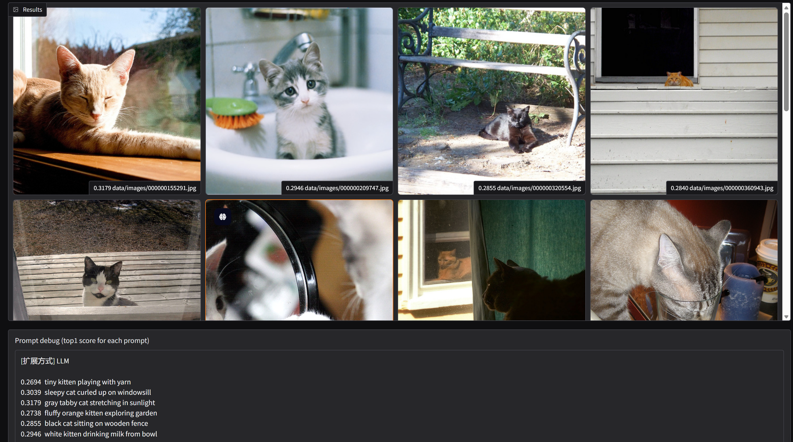
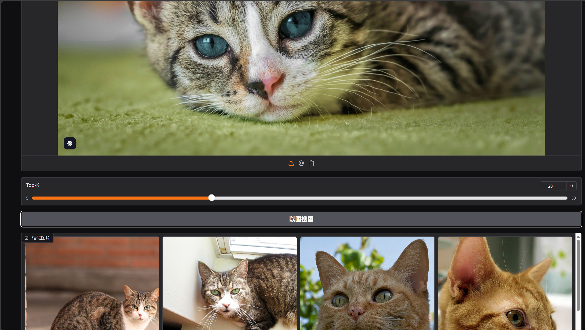
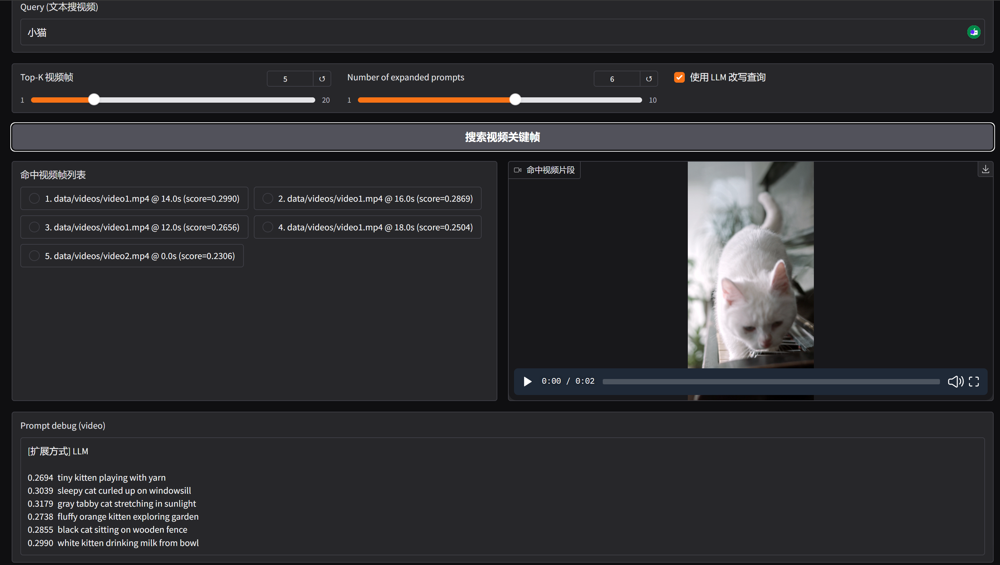
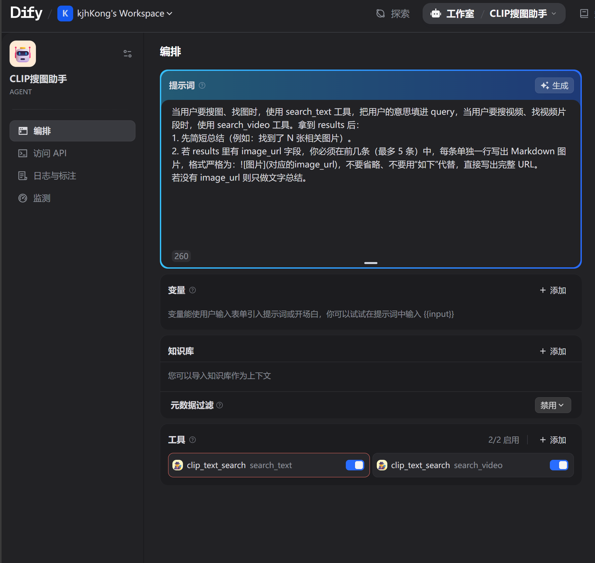

# 🔍 CLIP-MultiSearch

**A CLIP-based multimodal retrieval system | Text-to-Image · Image-to-Image · Video Keyframe Search**

[](https://www.python.org/downloads/)
[](LICENSE)
[](https://colab.research.google.com/github/yourusername/CLIP-MultiSearch)

> **CLIP-MultiSearch** is a lightweight multimodal semantic search system built on **OpenAI CLIP**.  
> It supports natural language image retrieval, query expansion, and is designed to be easily extended to image-to-image and video keyframe search.

---

## ✨ Core Features

| Feature | Description | Status |
|-------|------------|--------|
| 📝 **Text-to-Image Search** | Retrieve images using natural language queries | ✅ Implemented |
| 🖼️ **Image-to-Image Search** | Upload an image to find visually similar images in the same CLIP/FAISS index | ✅ Implemented |
| 🎬 **Video Keyframe Search** | Extract video keyframes, encode with CLIP, append to same index; text/image search returns video hits with path + timestamp | ✅ Implemented |
| 🔄 **Query Expansion & Fusion** | Expand queries to improve recall and robustness | ✅ Implemented |
| 🖥️ **LLM Query Rewrite** | Use LLM to rewrite queries into multiple English prompts for better Chinese retrieval | ✅ Implemented |
| 🌐 **Web Interface** | Interactive Gradio-based web UI | ✅ Implemented |
| 🤖 **Dify Agent** | Expose search as API tools; Agent uses natural language to trigger search and summarize results | ✅ Implemented |

---

## 🖼️ Interface Preview

Below shows the Gradio-based search interface for the query **"a girl"**, displaying top retrieved images with similarity scores.


**LLM Query Rewrite**: When "Use LLM to rewrite query" is enabled, Chinese or English input is rewritten into multiple short English visual phrases before retrieval, which significantly improves results for Chinese queries. Below: retrieval results and prompt debug info for a Chinese query (kitten) with LLM expansion.



**Image-to-Image Search**: In the Image-to-Image tab, upload a query image to retrieve the most semantically similar images from the indexed gallery (same CLIP embedding space and FAISS index as text search).



**Video Keyframe Search**: In the Video Keyframe tab, enter a text query to search for matching video keyframes. The system returns a ranked list of hits (video path + timestamp) and plays the corresponding short clip inline. LLM expansion is supported for Chinese queries.



**Dify Agent**: The same search logic is exposed as HTTP API and can be registered as custom tools in Dify. An Agent can use natural language to trigger text or video search and summarize results. Below: an Agent (e.g. "CLIP Search Assistant") answering a user query with search results.



---

## 📦 Requirements

- Python 3.8+
- PyTorch (CPU or CUDA)
- OpenAI CLIP
- FAISS (CPU)
- Gradio
- Pillow
- NumPy
- tqdm
- openai (for LLM query rewrite, OpenAI-compatible API)
- opencv-python (for video frame extraction)
- imageio-ffmpeg (bundled ffmpeg for video clip generation; no separate ffmpeg install required)

All dependencies are listed in `requirements.txt`. LLM rewrite is optional: without an API key, the UI falls back to rule-based query expansion.

---

## 🚀 Quick Start

```bash
# Clone the repository
git clone https://github.com/yourusername/CLIP-MultiSearch.git
cd CLIP-MultiSearch

# Install dependencies
pip install -r requirements.txt

# Prepare data
mkdir -p data/images
# Place your images into data/images/

# Build FAISS index (images)
python src/build_index.py

# (Optional) Add video keyframes: place videos in data/videos/, then run
python src/build_video_index.py

# (Optional) Configure LLM rewrite: create .env in project root with:
#   SILICONFLOW_API_KEY=your_key
# SiliconFlow DeepSeek API; default base is https://api.siliconflow.cn/v1

# Launch the web interface (Text search + Image-to-image + Video keyframe search tabs)
python src/ui_gradio.py


⚙️ Indexing Parameters

The indexing pipeline supports the following configurable parameters:

| Parameter      | Default       | Description                                   |
| -------------- | ------------- | --------------------------------------------- |
| `--data_dir`   | `data/images` | Directory containing images to index          |
| `--out_dir`    | `storage`     | Output directory for FAISS index and metadata |
| `--model_name` | `ViT-B/32`    | CLIP model variant                            |
| `--batch_size` | `32`          | Batch size for image encoding (CPU-friendly)  |

```

---
## Examples:

    python src/build_index.py --data_dir data/images --batch_size 16
    python src/build_video_index.py --video_dir data/videos --interval_sec 2.0

---

## 🤖 API for Dify Agent

A FastAPI server exposes the same search logic as HTTP endpoints so you can use them as **Dify custom API tools**:

- `POST /search/text` — text-to-image search
- `POST /search/video` — text-to-video keyframe search  
- `POST /search/image` — image-to-image search (file upload or base64)

Run the API from project root:

```bash
pip install -r requirements.txt   # includes fastapi, uvicorn
python -m uvicorn src.api_fastapi:app --host 0.0.0.0 --port 8000
```

- **Health check**: `GET /health` returns `{"status":"ok", "service": "CLIP-MultiSearch API", "version": "0.1.0"}` for liveness probes.

See **[docs/API_DIFY.md](docs/API_DIFY.md)** for endpoint details and step-by-step Dify tool configuration.

---

## 📌 Project Scope

This project focuses on **multimodal retrieval (image + video keyframes) and Agent integration**. It does **not** include a document RAG or knowledge-base backend; the Dify Agent uses only the CLIP search API as tools. Possible future extensions (e.g. document RAG, other modalities) are left out of scope for this repo.

---

## 🔎 Search Parameters (Web UI)

The Gradio interface has three tabs: **text-to-image**, **image-to-image**, and **video keyframe search**.

| Tab / Parameter                | Description                                                                 |
| ------------------------------ | --------------------------------------------------------------------------- |
| **text-to-image**              | Natural language query; optional LLM rewrite; multi-prompt fusion.         |
| **Query**                      | Natural language query (English or Chinese)                                 |
| **Top-K**                      | Number of retrieved results                                                 |
| **Number of expanded prompts** | Number of expanded queries for retrieval fusion                            |
| **Use LLM to rewrite query**   | SiliconFlow DeepSeek rewrites into multiple English prompts (recommended for Chinese) |
| **image-to-image**             | Upload an image to find visually similar images from the index.            |
| **Upload image**               | Query image (file or paste)                                                 |
| **video keyframe search**      | Text query to search video keyframes; returns ranked hits and plays clips inline. |
| **Query (text search video)**  | Natural language query (English or Chinese)                                 |
| **Top-K video frames**         | Number of video keyframe results to return                                  |
| **Number of expanded prompts** | Same as text-to-image tab                                                   |
| **Use LLM to rewrite query**   | Same as text-to-image tab                                                   |
