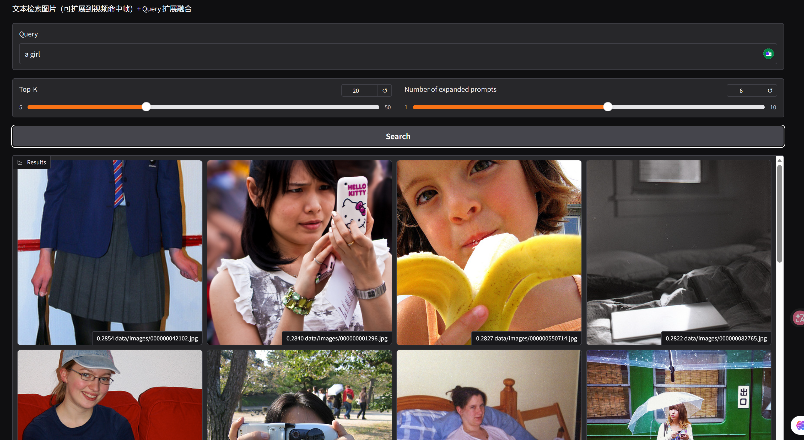

# 🔍 CLIP-MultiSearch

**A CLIP-based multimodal retrieval system | Text-to-Image · Image-to-Image · Video Keyframe Search**

[](https://www.python.org/downloads/)
[](LICENSE)
[](https://colab.research.google.com/github/yourusername/CLIP-MultiSearch)

> **CLIP-MultiSearch** is a lightweight multimodal semantic search system built on **OpenAI CLIP**.  
> It supports natural language image retrieval, query expansion, and is designed to be easily extended to image-to-image and video keyframe search.

---

## ✨ Core Features

| Feature | Description | Status |
|-------|------------|--------|
| 📝 **Text-to-Image Search** | Retrieve images using natural language queries | ✅ Implemented |
| 🖼️ **Image-to-Image Search** | Upload an image to find visually similar images | 🔄 In Progress |
| 🎬 **Video Keyframe Search** | Extract video keyframes and enable semantic search | 🔄 In Progress |
| 🔄 **Query Expansion & Fusion** | Expand queries to improve recall and robustness | ✅ Implemented |
| 🌐 **Web Interface** | Interactive Gradio-based web UI | ✅ Implemented |

---

## 🖼️ Interface Preview

Below shows the Gradio-based search interface for the query **"a girl"**, displaying top retrieved images with similarity scores.



---

## 📦 Requirements

- Python 3.8+
- PyTorch (CPU or CUDA)
- OpenAI CLIP
- FAISS (CPU)
- Gradio
- Pillow
- NumPy
- tqdm

All dependencies are listed in `requirements.txt`.

---

## 🚀 Quick Start

```bash
# Clone the repository
git clone https://github.com/yourusername/CLIP-MultiSearch.git
cd CLIP-MultiSearch

# Install dependencies
pip install -r requirements.txt

# Prepare data
mkdir -p data/images
# Place your images into data/images/

# Build FAISS index
python src/build_index.py

# Launch the web interface
python src/web/gradio_ui.py


⚙️ Indexing Parameters

The indexing pipeline supports the following configurable parameters:

| Parameter      | Default       | Description                                   |
| -------------- | ------------- | --------------------------------------------- |
| `--data_dir`   | `data/images` | Directory containing images to index          |
| `--out_dir`    | `storage`     | Output directory for FAISS index and metadata |
| `--model_name` | `ViT-B/32`    | CLIP model variant                            |
| `--batch_size` | `32`          | Batch size for image encoding (CPU-friendly)  |

```

---
## Example:

    python src/build_index.py --data_dir data/images --batch_size 16
---
🔎 Search Parameters (Web UI)

The Gradio web interface exposes the following parameters:
| Parameter                      | Description                                          |
| ------------------------------ | ---------------------------------------------------- |
| **Query**                      | Natural language query (English or Chinese)          |
| **Top-K**                      | Number of retrieved results                          |
| **Number of Expanded Prompts** | Number of expanded queries used for retrieval fusion |
